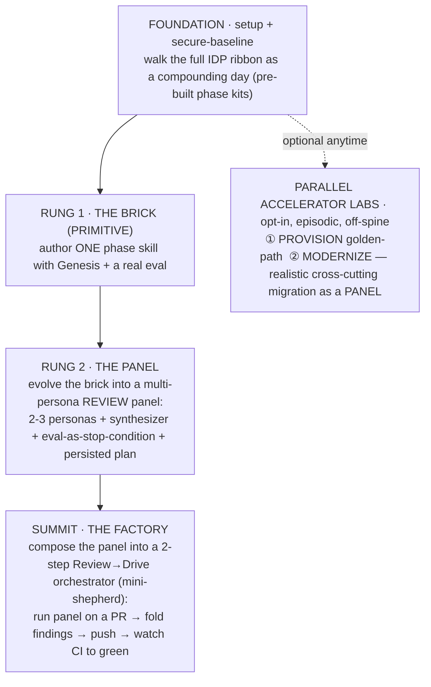

# Zava Skills Workshop — Composition Arc Redesign (Design Spec)

> ⚠️ **SUPERSEDED (2026-06-18)** by `2026-06-18-zava-workshop-three-tracks-design.md`.
> This "climb / rungs / summit" arc was rejected for forced vocabulary and for removing
> track selection. Kept for history only. Do not implement from this file.

**Date:** 2026-06-17
**Status:** Approved (arc), in implementation
**Audience for the workshop:** ~50 elite engineers, full-day, hands-on
**This document is the canonical contract.** Every doc, guide, golden example, and
scaffold in the redesign must conform to the names, paths, terminology, theory
anchors, and scope decisions defined here. When in doubt, this file wins.

---

## 1. Why we are redesigning

The current template is polished but teaches **one vertical move four times**. Four
parallel leaf tracks (`test-improver`, `docs-generator`, `dependency-auditor`,
`framework-modernizer`) each author a *single* leaf skill and stop at "I shipped one
skill." Three honest problems for a full-day, elite audience:

1. **Track 4 is low-agency by construction.** A fixed ~8-row catalog + regexes + a tiny
   fixture; its own DESIGN brags that "PIPELINE beat PANEL, classification is
   mechanical." It ships no artifact the participant authored. In a live run it "gave
   the room virtually nothing to migrate." Anticlimax.
2. **The day plateaus.** Authoring one leaf primitive, repeated, never climbs. For 50
   top engineers across a full day it is repetitive and under-ambitious.
3. **It teaches only half the architecture.** The differentiated value of the Agentic
   SDLC is **composition** — primitives composing into panels, panels composing into
   orchestrators, orchestrators forming a self-driving software factory
   (handbook ch22, "the reference architecture earned"). The current workshop never
   gets there.

**The redesign keeps the strong parts** (Genesis-first design, real evals, package
lifecycle, gh-aw CI, supply-chain governance, the "your skill / my code" platform
claim) and **adds the missing half**: a single compounding climb that summits at a
factory the participant *built and operated*.

---

## 2. The Arc (approved)

One shared, compounding climb. Each rung is a strictly higher-order primitive. The full
IDP SDLC ribbon is the **narrative frame**; the hands-on build is one
**REVIEW→RELEASE slice** of that ribbon, authored from scratch.

### 2.1 IDP ribbon mapping

The Zava IDP ribbon is `PROVISION → IDEATE → PLAN → CODE → BUILD → TEST → REVIEW →
RELEASE → OPERATE`, with a `secure-baseline` foundation under every phase, and
`MODERNIZE` as an episodic accelerator (not a phase).

- **Spine = the compounding everyday flow**, experienced as narrative:
  `IDEATE → CODE → REVIEW → RELEASE → OPERATE`. Participants *see the whole ribbon* via
  the pre-built phase kits (ideate-kit, code-kit, review-kit, release path, operate
  path) framed as "a day in the life of the compounding developer."
- **Hands-on climb = build the REVIEW→RELEASE slice yourself**: brick → panel →
  orchestrator. This is why the day can summit at "build a factory" without authoring
  five separate phase skills.
- **Accelerators = PROVISION + MODERNIZE**, exactly as the IDP taxonomy frames them:
  episodic, opt-in, off-spine.

**The embedded design bet (stated plainly in the README):** the full ribbon is
delivered as guided narrative/demo using pre-built phase kits, while the *from-scratch
build* is scoped to the REVIEW→RELEASE slice. That keeps "build a factory in a day"
feasible for 50 people.

---

## 3. Rung-by-rung specification

The substrate is the **same skill family growing across rungs** on the canonical target
app `DevExpGbb/zava-storefront` (Next.js + Postgres, cloned at tag `workshop-v1`,
gitignored). Continuity is the point: the brick a participant builds in Rung 1 becomes a
*persona inside* the panel in Rung 2, and the panel becomes the *engine inside* the
orchestrator at the Summit.

### Rung 1 — THE BRICK (author a primitive)

- **What they build:** one narrowly-scoped phase skill with Genesis + a real eval.
- **Canonical exemplar:** `test-improver` (cleanest oracle — `npm test` is deterministic
  truth). The other former leaf primitives are demoted to **alternate bricks** (an
  appendix menu), not parallel tracks.
- **Authored at:** `.apm/skills/test-improver/` (or the participant's chosen brick).
- **Key disciplines (kept from today):** Genesis design-before-code with an architecture
  diagram; eval with/without delta (`with_skill` PASS **and** measurable delta vs
  `without_skill`); Reduced Scope + Safety Boundaries; deterministic oracle, not
  self-judging.
- **Theory anchors:** ch21 (primitives-as-code), ch13 (PROSE specification),
  ch19 (Rosetta Stone — verification loops), ch16 (deterministic/probabilistic boundary).
- **Output:** a packed, eval-backed brick + the muscle memory of "design → build →
  eval → pack."

### Rung 2 — THE PANEL (compose personas)

- **What they build:** evolve the brick into a **multi-persona REVIEW panel** — a
  fan-out + synthesizer skill. This is ch22's recursive `Skill → Persona → Context`
  unit, hands-on.
- **Shape (simplified from `awd-cli/apm-review-panel`):**
  - **3 specialist personas**, each running in its own agent thread (the `task` tool),
    each returning **structured JSON** matching a panelist return schema:
    `correctness-reviewer`, `security-reviewer`, `test-coverage-reviewer`.
  - **1 synthesizer** (CEO-style) that consumes all panelist JSON and renders **ONE
    advisory recommendation comment** (no merge gate, no verdict labels).
  - **Severity buckets:** `blocking | recommended | nit` — none of them gate.
  - **Single-writer interlock:** only the orchestrator writes to the PR (one comment).
- **eval-as-stop-condition:** the panel's recursion is bounded in *space* by
  schema-validated persona returns (a panelist that doesn't return valid JSON is
  re-run, not trusted), and bounded in *time* by a **persisted plan** that survives
  across threads.
- **Authored at:** `.apm/skills/review-panel/` with
  `personas/correctness-reviewer.md`, `personas/security-reviewer.md`,
  `personas/test-coverage-reviewer.md`, `personas/synthesizer.md`,
  `assets/panelist-return-schema.json`, `assets/recommendation-template.md`,
  `evals/`.
- **Theory anchors:** ch17 (multi-agent orchestration), ch22 (reference architecture
  earned — the recursive panel), ch15 (attention & context economy — eval-as-stop /
  attention anchor).
- **Golden example:** `docs/golden-examples/review-panel/` (see §6).

### Summit — THE FACTORY (drive a PR to green)

- **What they build:** compose the panel into a **2-step Review→Drive "mini-shepherd"
  orchestrator** — the REVIEW→RELEASE slice as a self-driving unit.
- **Shape (distilled from `awd-cli/shepherd-driver`):**
  1. **Run the panel** on a target PR (the panel is the per-PR review primitive).
  2. **Fold-by-default:** apply non-blocking (`recommended` / `nit`) findings as
     commits using a simple fold-vs-defer rubric; defer `blocking` to the human.
  3. **Push** the fold commits.
  4. **Watch CI to green:** poll the checks; on red, read the failure and attempt one
     bounded recovery pass; report completion.
- **Composition mechanics (the lesson):** the orchestrator declares a **dependency edge**
  on the panel in its `apm.yml` (`review-driver → review-panel`), the **lockfile pins**
  it, and `apm install` deploys the closure. This is the "lockfile-pinned skill
  dependency graph" of ch22 made concrete.
- **Authored at:** `.apm/skills/review-driver/` with `SKILL.md`,
  `assets/fold-vs-defer-rubric.md`, `assets/ci-recovery-checklist.md`, and an
  `apm.yml` dependency edge on `review-panel`.
- **Run target:** a seeded PR against `zava-storefront/` (e.g. a PR touching
  `zava-storefront/lib/**` with a couple of recommended-severity issues the panel will
  surface and the driver will fold).
- **Theory anchors:** ch22 (the earned reference architecture / "Maya's PR #4711"),
  ch17 (multi-agent orchestration), ch18 (the execution meta-process — plan
  persistence bounds recursion in time).
- **Golden example:** `docs/golden-examples/review-driver/` (see §6).
- **CI embodiment:** the redesigned `.github/workflows/my-workflow.md` runs the panel
  (or the driver's review step) on labeled PRs via gh-aw `engine: copilot`, posting the
  synthesis comment — the factory running in the outer loop.

---

## 4. The two accelerators (off-spine, parallel, opt-in)

Accelerators are episodic labs a participant can drop into when their day-job calls for
it. They are **not** rungs and do not block the climb.

### PROVISION — golden-path lab

- **What it teaches:** standing up a new service on the org golden path
  (`provision-golden-path` / provision-kit) — IssueOps front door, OIDC-to-Azure,
  CI + security wired, a live URL.
- **Shape:** lighter than the spine; a guided run of the golden-path provisioning flow
  with the governance guardrails called out.
- **Authored at:** `docs/accelerators/provision.md`.
- **Theory anchor:** ch04 (reference architecture — the platform layer).

### MODERNIZE — realistic cross-cutting migration as a PANEL (rebuilt)

This is the **root-cause fix** of the redesign. The toy Express4→5 regex-catalog
pipeline is replaced by a migration with **genuine ambiguity that warrants a panel of
migration specialists**.

- **The realistic scenario:** a cross-cutting migration that is *not* mechanical —
  **framework major bump + a breaking transitive dependency + a config/runtime flip**
  whose interactions force real judgment (e.g. ordering, compatibility windows,
  data/format migrations, rollback strategy). No single regex catalog can decide it.
- **Why a panel:** because the migration surface spans concerns (framework API changes,
  dependency breakage, config/runtime behavior), it is naturally a **fan-out to
  migration specialists + a synthesizer** that sequences the plan and flags the
  genuine risks. This ties the accelerator back to the composition theme — the panel
  pattern is reusable beyond review.
- **Honest contrast:** the lab explicitly contrasts the new panel-shaped approach with
  the retained **pipeline baseline** (`.apm/skills/framework-modernizer/`) and explains
  *when* a pipeline suffices vs *when* the judgment surface demands a panel.
- **Authored at:** `docs/accelerators/modernize.md`.
- **Theory anchors:** ch17 (multi-agent orchestration), ch19 (Rosetta Stone).
- **Scope flag (honest):** a fully realistic migration substrate larger than the current
  storefront lives upstream (`DevExpGbb/zava-storefront`) and is out of scope for this
  template session. The lab therefore provides a **concrete panel design + golden-style
  reference** against the existing storefront surfaces and is explicit about which step
  is "drive live" vs "reference deep-dive."

---

## 5. Full-day agenda (≈50 engineers)

Honest budgets; assumes prerequisites installed before the room (a pre-work email).
Total ≈ 6h15 of content + breaks/lunch.

| Block | Segment | Budget | Format |
|---|---|---|---|
| **Foundation** | Setup verify + secure-baseline + **walk the IDP ribbon** (narrated demo of the phase kits = "the compounding day") | 45 min | Individual + plenary |
| **Rung 1 · The Brick** | Genesis design → build → eval → pack one primitive | 75 min | Hands-on |
| — | Break | 15 min | — |
| **Rung 2 · The Panel** | Genesis design → 3 personas + synthesizer + schema + eval-as-stop | 90 min | Hands-on |
| — | Lunch | 45 min | — |
| **Summit · The Factory** | Compose driver → apm.yml edge + lockfile → run on a seeded PR → fold → push → watch CI green | 105 min | Hands-on |
| — | Break | 15 min | — |
| **Accelerator slot** | Choose PROVISION *or* MODERNIZE (parallel rooms / self-select) | 60 min | Hands-on, opt-in |
| **Synthesis** | The factory you built = the outer loop; "your factory / their repo"; what to build Monday | 30 min | Plenary |

**50-person logistics** (detailed in FACILITATOR.md): harness-matrix coverage, CI queue
weather at scale (stagger Summit PR runs; pre-create labels org-wide), pre-seeded PR
branches per participant or per pod, golden-example fallback for anyone whose own
artifact didn't compile so they can still complete the next rung.

---

## 6. Golden examples & scaffolding (where quality risk concentrates)

These must be **concrete and credible**, distilled+simplified from the real
`awd-cli` factory — not hand-wavy prose. They are the safety net (a participant who
falls behind reads the golden example and still climbs the next rung).

- `docs/golden-examples/review-panel/`
  - `SKILL.md` — fan-out + synthesizer, advisory regime, severity buckets,
    single-writer interlock, schema-validated returns.
  - `personas/correctness-reviewer.md`, `personas/security-reviewer.md`,
    `personas/test-coverage-reviewer.md`, `personas/synthesizer.md`.
  - `assets/panelist-return-schema.json`, `assets/recommendation-template.md`.
  - `evals/` — a render/trigger eval pair demonstrating eval-as-stop-condition.
- `docs/golden-examples/review-driver/`
  - `SKILL.md` — classify (optional) → run panel → fold-by-default → push → watch CI.
  - `assets/fold-vs-defer-rubric.md`, `assets/ci-recovery-checklist.md`.
  - `apm.yml` snippet — the `review-driver → review-panel` dependency edge + a note on
    the lockfile pin and transitive deploy.
- **Retained** golden examples: `test-improver.SKILL.md` (Rung-1 exemplar),
  `dependency-auditor.SKILL.md` + `.evals` (governance / alternate brick),
  `docs-generator.SKILL.md` (alternate brick).
- **Retained baseline:** `.apm/skills/framework-modernizer/` stays as the *pipeline
  baseline* the MODERNIZE lab contrasts against (do **not** delete).

---

## 7. Build vs reuse + governance (kept and elevated)

- **Eval discipline** is non-negotiable at every rung: a primitive without a measurable
  with/without delta is not shipped; a panel persona without a schema-validated return
  is re-run, not trusted.
- **Plan persistence** (ch18) is the time-bound on recursion at Rung 2 and the Summit.
- **Supply-chain governance** is retained: `secure-baseline`, the `security-fixtures/`
  preinstall guard, the dependency-auditor as the governance brick.
- **gh-aw CI** is the outer loop: the Summit's panel runs on PRs via `engine: copilot`
  with `safe-outputs`.
- **Platform claim** ("your skill / my code", §6 of today's README) is retained and
  elevated to **"your *factory* / their repo"**: a consumer pins your `review-driver`
  and gets the whole composed closure via `apm install`.

---

## 8. Naming, paths & terminology CONTRACT

**Every subagent MUST use exactly these.** Divergence here is the main failure mode.

### 8.1 Canonical vocabulary
- The day is **"the climb"**. Its stages are **Foundation**, **Rung 1 · The Brick**,
  **Rung 2 · The Panel**, **Summit · The Factory**, plus **Accelerators**.
- Never call them "tracks" in the new arc except when referring to the *retired* leaf
  model historically. Participants follow ONE shared climb, not parallel tracks.
- The summit orchestrator is the **"mini-shepherd"** / **`review-driver`**. The panel is
  the **`review-panel`**. The Rung-1 exemplar is **`test-improver`**.

### 8.2 File map (authoritative)
| Path | Action | Owner todo |
|---|---|---|
| `README.md` | rewrite | rd-readme |
| `docs/tracks/rung-1-primitive.md` | add (from `01-test-improver.md`) | rd-rungs |
| `docs/tracks/rung-2-panel.md` | add | rd-rungs |
| `docs/tracks/summit-factory.md` | add | rd-rungs |
| `docs/tracks/appendix-alternate-bricks.md` | add (folds 02/03/04 essence) | rd-rungs |
| `docs/tracks/01-test-improver.md` … `04-…md` | retire (delete after content folded) | rd-rungs |
| `docs/accelerators/provision.md` | add | rd-accelerators |
| `docs/accelerators/modernize.md` | add (rebuilt, panel-shaped) | rd-accelerators |
| `docs/golden-examples/review-panel/**` | add | rd-golden |
| `docs/golden-examples/review-driver/**` | add | rd-golden |
| `docs/golden-examples/{test-improver,docs-generator,dependency-auditor}.*` | keep | — |
| `docs/FACILITATOR.md` | rewrite (full-day, 50 eng) | rd-facilitator |
| `apm.yml` / `apm.lock.yaml` | update (scripts/comments; deps minimal) | rd-plumbing |
| `.github/workflows/my-workflow.md` | update (panel-on-PR) | rd-plumbing |
| `.apm/skills/my-skill/SKILL.md` | update (reframe as Rung-1 starter) | rd-plumbing |
| `.apm/skills/framework-modernizer/**` | keep (pipeline baseline) | — |

### 8.3 Handbook theory-anchor map (all verified 200 on 2026-06-17)
Base: `https://danielmeppiel.github.io/agentic-sdlc-handbook/handbook/`
| Stage | Primary anchors |
|---|---|
| Foundation / ribbon | `ch04-the-reference-architecture`, `ch01-the-agentic-sdlc-thesis` |
| Rung 1 · Brick | `ch21-primitives-as-code`, `ch13-the-prose-specification`, `ch19-architectural-patterns-rosetta-stone`, `ch16-deterministic-probabilistic-boundary` |
| Rung 2 · Panel | `ch17-multi-agent-orchestration`, `ch22-the-reference-architecture-earned`, `ch15-attention-and-context-economy` |
| Summit · Factory | `ch22-the-reference-architecture-earned`, `ch17-multi-agent-orchestration`, `ch18-the-execution-meta-process` |
| Accelerator · Modernize | `ch17-multi-agent-orchestration`, `ch19-architectural-patterns-rosetta-stone` |
| Going further | `ch27-what-comes-next` |

**STALE LINKS TO FIX everywhere they appear:** old `ch12-the-prose-specification` →
`ch13-the-prose-specification`; old `ch18-architectural-patterns-rosetta-stone` →
`ch19-architectural-patterns-rosetta-stone`. (The handbook was renumbered; the current
template's links 404.)

### 8.4 Pinned versions / substrate (unchanged unless §9 says otherwise)
- Kits: `DevExpGbb/zava-agent-config/plugins/<kit>#v5.0.1`; Genesis `#v0.1.0`.
- Target app: `DevExpGbb/zava-storefront` at `--branch workshop-v1`.
- Storefront tests: 7/7 green; modernizer eval: `node .apm/skills/framework-modernizer/evals/run.js`.

---

## 9. Scope & honest non-goals (this session)

**In scope:** redesign the *template repo's* narrative + guides + golden-example
scaffolding to the compounding arc, internally consistent and top-quality; fix stale
theory links; rebuild the modernize lab; add panel/driver golden examples; rewrite
README + FACILITATOR; update apm.yml/CI plumbing minimally.

**Out of scope (stated, not hidden):**
- Modifying upstream repos (`zava-storefront`, `zava-agent-config`, `genesis`,
  `awd-cli`). Golden examples are *distilled* into this repo, not pulled from upstream.
- Live LLM execution of the new exercises end-to-end, and org redeploy verification
  (requires admin tokens + a room). Where an exercise depends on an out-of-repo surface,
  the guide is concrete and **honestly labels** "drive live" vs "reference deep-dive."
- Adding `apm` dependencies that do not already exist upstream under the org allowlist.
  Extra ribbon phases are narrated via docs, not necessarily installed deps.

**Verification this session:** internal consistency (names/paths/links/durations/ribbon
mapping/no orphan track refs/golden examples exist/theory links resolve 200), plus any
oracle that still applies (storefront tests, modernizer eval) where the substrate is
present.

---

## 10. Implementation orchestration

Plan + checkpoints live in the session SQLite (`todos` prefix `rd-`, `gap_analysis`
table). Subagents are dispatched against this contract; the orchestrator (main thread)
writes the design + contract, runs golden examples + theory verification itself, then
fans out doc authoring to subagents, then runs the §9 consistency verification and
produces the final report. Terminal gate: the narrative arc + README flow read as one
coherent, top-quality climb.
