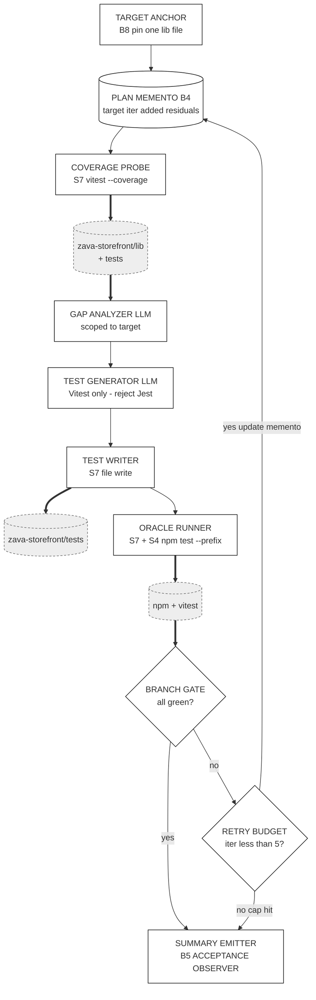

# Track 1 · `test-improver`

> **You are not fixing the app. You are authoring a Skill** that finds untested branches in `zava-storefront/lib/cart.ts` (and friends), proposes the missing tests, runs `npm test`, and iterates until green.

⏱️ **90 min**

---

## 📚 Theory anchor

- **Live:** [Architectural Patterns Rosetta Stone — *Verification Loops*](https://danielmeppiel.github.io/agentic-sdlc-handbook/handbook/ch19-architectural-patterns-rosetta-stone.html)
- **Live:** [The PROSE Specification](https://danielmeppiel.github.io/agentic-sdlc-handbook/handbook/ch13-the-prose-specification.html)

**Local fallback (3 sentences):** A Skill is a *narrowly-scoped procedure* an agent invokes — not a generalist prompt. The PROSE constraint *Reduced Scope* tells us the test-improver should refuse anything other than "fill missing test coverage in this file"; *Safety Boundaries* keep it from editing source under test. The verification loop pattern (write → run → read failure → refine) is what turns "Copilot drafted some tests" into "the test suite actually passes."

---

## 🔍 Discover the problem

Open these three files:

- [`zava-storefront/lib/cart.ts`](https://github.com/DevExpGbb/zava-storefront/blob/workshop-v1/lib/cart.ts) · `addItem`, `applyDiscount`, `computeTax`, `totalize`
- [`zava-storefront/lib/orders.ts`](https://github.com/DevExpGbb/zava-storefront/blob/workshop-v1/lib/orders.ts) · `createOrder`, `findOrder`, `fulfillmentMessage`
- [`zava-storefront/tests/cart.test.ts`](https://github.com/DevExpGbb/zava-storefront/blob/workshop-v1/tests/cart.test.ts) · note the comment block at the bottom listing **uncovered branches**

Now ask your AI chat assistant (no Skill, no extra context) the naïve prompt:

> "Add tests for `lib/cart.ts`."

Observe:

- It might use Jest syntax — but this app uses **Vitest**.
- It probably misses `applyDiscount` edge cases (`VIP25` threshold, unknown codes).
- Run it twice. Different drafts each time.

That drift is what a Skill removes.

---

## 🧠 Design with Genesis (5 min)

[`genesis`](https://github.com/DevExpGbb/genesis) is pinned in `apm.yml` as a design assistant. Invoke it before writing any `SKILL.md`.

In your IDE (your agent harness — Copilot CLI, Claude Code, Codex, Cursor, OpenCode all work), summon Genesis. **Verify it's loaded first** — type `/genesis` and confirm autocomplete or an acknowledgment from the persona. If nothing happens, run `apm install` again and check `.agents/skills/genesis/` exists.

```
/genesis I want a test-improver skill. It must:
- Target a single source file under zava-storefront/lib/
- Detect functions whose branches/error paths are uncovered by zava-storefront/tests/
- Generate vitest tests for the missing branches (NOT Jest)
- Run `npm test --prefix zava-storefront` after each iteration
- Stop when all branches are green or after 5 iterations
- Emit one final summary comment listing what it added

Draw an ASCII art diagram of the proposed skill architecture and explain the reasons of the design.
```

Genesis returns an ASCII diagram + a design rationale. **Read both before coding.** That output *is* your spec — don't ask your harness to generate the skill until you've read what Genesis chose and why.

### What Genesis returned for this brief

The diagram below is rendered in Mermaid for GitHub readability — but Genesis emits ASCII into your chat. Same components, same edges. Yours may differ in naming / node count; what matters is whether the **architectural choices** below show up.



**Why this shape (rationale Genesis explained):**

- **A supervised loop with a bounded retry arm.** Convergence ("all branches in target file covered") is a deterministic tool fact, not a goal-alignment judgment — so the oracle is `npm test`, not the LLM. (Genesis names this *SUPERVISED EXECUTION* — chosen over a self-judging *ALIGNMENT LOOP* for that reason.)
- **A persisted plan that reloads each iteration.** Target file, iteration counter, and added-tests ledger survive across rounds — without that, the loop drifts on its own short memory. (Genesis: *PLAN MEMENTO*.)
- **Scope locked to one file, top of the loop.** Long-context drift cannot widen the blast radius mid-run. (Genesis: *ATTENTION ANCHOR*.)
- **A deterministic tool wraps every consequential step** — coverage probe, file write, `npm test`. The LLM never re-derives coverage from recall. (Genesis: *DETERMINISTIC TOOL BRIDGE*.)
- **Hard 5-iteration cap.** Guards against an unbounded loop. Cap-hit is treated as a real outcome (summary still emits), not silent failure.
- **Out of scope (deliberate):** editing `lib/` source, multi-file targets, fixing pre-existing failing prod tests.

> 💾 **Persist Genesis's output.** Don't lose it to chat scrollback. Save it (the ASCII + rationale) to `.apm/skills/test-improver/DESIGN.md` (after step 2 below creates the folder) so future redesigns start from a real artifact.

---

## 🛠️ Build (15 min) — *let Genesis implement what Genesis designed*

In the same chat where Genesis just emitted the design, prompt your harness:

> Now use the genesis skill to implement the skill per our agreed design. Place it at `.apm/skills/test-improver/`.

That's it. Genesis takes over: it applies its own step-7b discipline (probe runtime, draft SKILL.md, validate against the design). Any installed instructions — like `prose-style.md` from `code-kit` — get loaded by the harness automatically; you don't need to remind Genesis what frontmatter shape to use.

Review the output node-for-node against the design diagram.

### Iterate naturally

The high-leverage moves aren't tweaks to the *original* prompt — they're new asks that build on what Genesis just shipped. Each one shows Genesis applying its own discipline to a real evolutionary need:

- **Add real behavior evals** *(the agentskills.io kind)*. *"Use the genesis skill to add evals for this skill."* Genesis applies its step-6 EVALS PLAN: 2-3 content evals where each prompt runs **twice** — with the skill loaded and without it — so the value delta is measurable. Plus ~20 trigger evals (8-10 should-trigger + 8-10 near-miss, 60/40 train/val) for the dispatch description. Output: `evals/evals.json` + `evals/triggers.json`. Per the spec, **assertions are added after the first run** — iteration 1 explores, iteration 2 hardens. Ship gate: `with_skill` PASS AND measurable delta vs `without_skill`. If they're indistinguishable, the skill is not adding value.
- **Make it run in CI/CD.** *"Use the genesis skill to make this run in CI/CD."* Genesis proposes a [`gh-aw`](https://githubnext.com/projects/agentic-workflows/) agentic workflow — trigger label, paths filter, the same skill that runs in your IDE now running on PRs.
- **Modularize the specialist personas.** *"Use the genesis skill to modularize the specialist personas as a separate apm package."* Genesis proposes a package split — pulls the reusable personas into their own pinnable APM package.

That's the loop you'll keep using long after the workshop: the skill grows by composition, not by hand-edits.

📁 Stuck? Peek at [`docs/golden-examples/test-improver.SKILL.md`](../golden-examples/test-improver.SKILL.md) — but only after Genesis has produced its first draft.

---

## ✅ Validate locally (5 min)

In your IDE, drive the skill:

> "Use the test-improver skill on `zava-storefront/lib/cart.ts`."

Watch the agent:

1. Read `cart.ts`.
2. Compare against `tests/cart.test.ts`.
3. Generate new vitest cases (e.g. for `VIP25`, `WELCOME10`, `computeTax` regions).
4. Run `npm test --prefix zava-storefront`.
5. Iterate.

When the loop converges, run it yourself:

```bash
npm test --prefix zava-storefront
```

You should see new tests covering the cases listed in `cart.test.ts`'s comment block.

---

## 📦 Package locally (5 min) — *see what `apm pack` actually ships*

Before you automate anything, run the pack command yourself and look at the artifact:

```bash
apm pack --archive
ls build/
# → build/test-improver-0.1.0.tar.gz

tar tzf build/test-improver-0.1.0.tar.gz
```

You'll see the bundle contains:

- `plugin.json` — synthesized from your `apm.yml` (run `apm init --plugin` if you want to commit one explicitly)
- `apm.lock.yaml` — dependency pin manifest
- `skills/test-improver/SKILL.md` — what consumers actually load
- `skills/test-improver/references/`, `evals/` — anything else under your skill folder

That tarball is your skill bundle. Hand it to a teammate, they `apm install` it, and your skill is live in their harness. **No magic** — a manifest and a directory tree.

> 💡 **Why didn't Genesis or the kits end up in the tarball?** They're `devDependencies` in `apm.yml` — author-time tooling, not runtime requirements of your skill. `apm pack` excludes them, so consumers don't pull them transitively. The scanner also only looks under `.apm/` (which is why the Build prompt told Genesis to place your skill at `.apm/skills/test-improver/`). See [dev-only primitives](https://microsoft.github.io/apm/guides/dev-only-primitives/) and [`includes:` schema](https://microsoft.github.io/apm/reference/manifest-schema/#39-includes).

## 🚀 Automate the release (5 min)

Now that you've seen the local flow, automate it. The [release workflow](../../.github/workflows/release.yml) runs the same `apm pack` on every tagged push:

```bash
git add . && git commit -m "feat: test-improver skill v0.1.0"

# If you ran multiple tracks in the same repo, scope the tag:
git tag v0.1.0-test-improver   # or just v0.1.0 if this is your only track
git push origin main --tags
```

> 💡 **Tag collision warning.** Every track guide says `git tag v0.1.0`. If you re-run or run multiple tracks in the same repo, scope per-track (`v0.1.0-test-improver`) or delete the old tag first (`git tag -d v0.1.0 && git push --delete origin v0.1.0`).

The [release workflow](../../.github/workflows/release.yml) validates → packs → publishes a GitHub Release with the tarball attached.

---

## 🌐 Automate (15 min) — run your skill in CI

The skill you just released is now a portable artifact. Time to make your own CI a consumer of it.

The template ships a starter [gh-aw](https://github.github.com/gh-aw/) workflow at [`.github/workflows/my-workflow.md`](../../.github/workflows/my-workflow.md). gh-aw workflows are markdown: YAML frontmatter for triggers + permissions, then a natural-language prompt the agent runs. Replace the file's contents with this — note the `packages:` line pins the release tag you just pushed:

```markdown
---
on:
  pull_request:
    types: [labeled]
    paths: ['zava-storefront/lib/**']
  workflow_dispatch:
  roles: [admin, maintainer, write]

if: |
  (github.event_name == 'pull_request' && github.event.label.name == 'run-test-improver')
  || github.event_name == 'workflow_dispatch'

permissions:
  contents: read
  pull-requests: read
  issues: read

network: defaults

engine:
  id: copilot

# Pin the skill you just released. apm-action will download this tarball
# at run-time and make `test-improver` available to the agent below.
imports:
  - uses: shared/apm.md
    with:
      packages:
        - <your-org>/<your-repo>#v0.1.0-test-improver

safe-outputs:
  add-comment:
    max: 1

timeout-minutes: 15
---

# Run test-improver

You are running the **`test-improver`** Agent Skill against this repository's
`zava-storefront/` directory. Follow its `SKILL.md` exactly. Post a 3–5 bullet
summary of files read, files modified, tests run, and follow-ups via `add-comment`.

Do not modify files outside `zava-storefront/`. Do not merge or label the PR.
```

Then create the trigger label, compile, and push:

> 💡 **Before you push — gh aw auth.** If `gh aw compile` succeeds but the workflow run fails at the Copilot step with `Resource not accessible by personal access token` or `401 no token`, the `COPILOT_GITHUB_TOKEN` org secret isn't set or isn't visible to this repo. Run `gh secret list --org <your-org>` to confirm. If missing, an org admin sets it — see [`zava-workshop-kit/docs/tokens.md`](https://github.com/DevExpGbb/zava-workshop-kit/blob/main/docs/tokens.md). You don't need your own PAT; the org secret with `--visibility=all` covers your repo. Spec: fine-grained PAT, resource owner = user account, single permission `Account → Copilot Requests: Read`, owner has an active Copilot seat. See [`gh aw` auth reference](https://github.github.com/gh-aw/reference/auth/#copilot_github_token).

```bash
gh label create run-test-improver --color B0E0FF --description "Run the test-improver skill on this PR"
gh aw compile      # → .github/workflows/my-workflow.lock.yml
git add .github/workflows/ && git commit -m "ci: wire test-improver in CI"
git push
```

Open a PR touching `zava-storefront/lib/cart.ts`, label it `run-test-improver`, and watch your skill execute on the PR — that's the inner→outer loop transition.

> 💡 **The release tag you just pushed is what your CI pins.** The `apm pack` → release tarball → `imports.with.packages` chain is the same mechanism another team would use to consume your skill — your CI just happens to be one of those consumers. Bump the tag, bump the pin: same flow as any versioned dependency.

> 💡 **What is `shared/apm.md`?** A vendored gh-aw [shared workflow component](https://microsoft.github.io/apm/integrations/gh-aw/) that turns `packages:` into a real `apm install` step in your compiled workflow. The template ships it pre-vendored at [`.github/workflows/shared/apm.md`](../../.github/workflows/shared/apm.md). If you ever start a workflow from scratch in another repo, copy it once: `mkdir -p .github/workflows/shared && curl -sSL https://raw.githubusercontent.com/microsoft/apm/main/.github/workflows/shared/apm.md > .github/workflows/shared/apm.md`. See [`gh aw` reference: workflow lock file](https://github.github.com/gh-aw/reference/faq/#what-is-a-workflow-lock-file) for why the `.md` and `.lock.yml` both ship.

> 💡 **Compose with kit primitives.** Add more lines under `packages:` — e.g., `DevExpGbb/zava-agent-config/plugins/review-kit#v5.0.1` to also load review-kit's panel skill alongside your own. Same import block, more skills available to the agent.

---

## 🌍 Platform payoff (your Skill in someone else's repo)

After §2 of the README, your team-mate can pin your tarball in *their* repo:

```yaml
# their apm.yml
dependencies:
  apm:
    - <your-org>/<your-repo>#v0.1.0-test-improver
```

`apm install` in their repo gets them the same `SKILL.md`, the same `allowed-tools` boundary, the same workflow scaffold. Versioned, reviewable, composable — **that's the package-manager-for-skills claim**.

---

## 🎓 What you learned

- **Genesis = design before code.** You wrote a spec (with an ASCII architecture diagram), then implemented to it.
- **Reduced Scope is real.** Your Skill targets *one file pattern*, not "test the codebase."
- **Local-first, CI second.** Same Skill, same agent, same outcome — whether you run it in your IDE or as a `gh aw` job.
