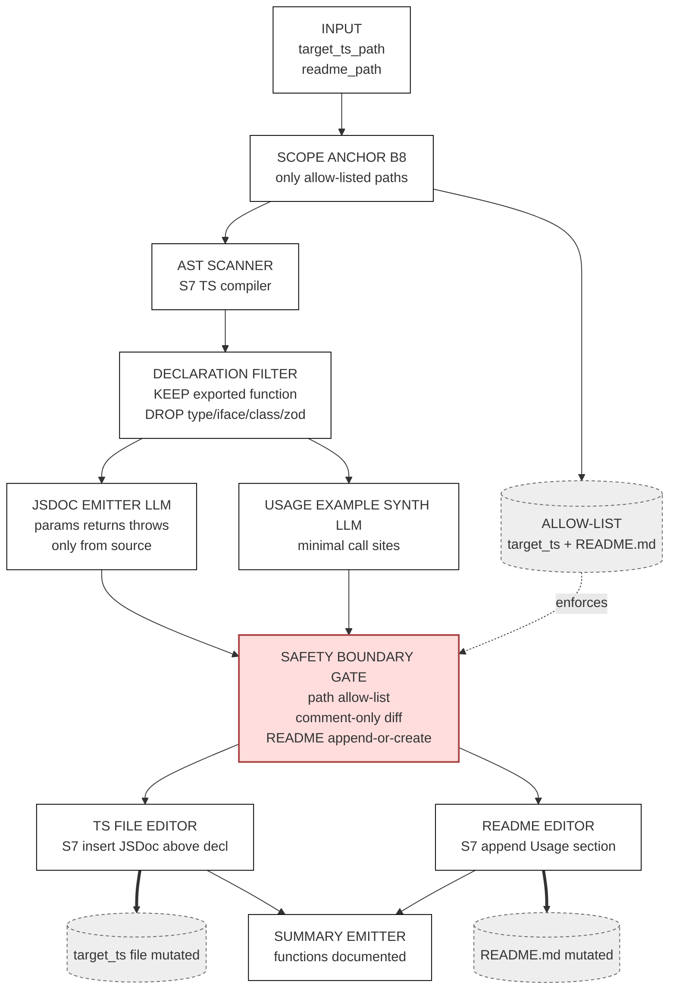

# Track 2 · `docs-generator`

> **You are not fixing the app. You are authoring a Skill** that reads `zava-storefront/lib/*.ts`, detects undocumented exported **functions**, and emits JSDoc + a README usage section — without inventing behavior.

⏱️ **90 min**

---

## 📚 Theory anchor

- **Live:** [The Reference Architecture — *Documentation as a closed loop*](https://danielmeppiel.github.io/agentic-sdlc-handbook/handbook/ch04-the-reference-architecture.html)
- **Live:** [The PROSE Specification](https://danielmeppiel.github.io/agentic-sdlc-handbook/handbook/ch13-the-prose-specification.html)

**Local fallback (3 sentences):** A docs-generator Skill is a discipline test for the PROSE constraint *Safety Boundaries* — the agent **must not** invent behavior that isn't in the source, even when the source is sparse. *Progressive Disclosure* shapes the output: short JSDoc above each export, then a single "Usage" section with one minimal example each. The win: the same Skill produces the same docs whether a junior or a senior triggers it.

---

## 🔍 Discover the problem

This Skill targets exported **functions** only. Type aliases, interfaces, and zod schemas are out of scope — that scope decision lives in the Skill's `When to use` section and is enforced by the oracle in §5.

Open these:

- [`zava-storefront/lib/cart.ts`](https://github.com/DevExpGbb/zava-storefront/blob/workshop-v1/lib/cart.ts) — **5 exported functions** (8 named exports total: 3 are types/schemas, out of scope), zero JSDoc.
- [`zava-storefront/lib/orders.ts`](https://github.com/DevExpGbb/zava-storefront/blob/workshop-v1/lib/orders.ts) — **5 exported functions** (8 named exports total), zero JSDoc.
- [`zava-storefront/lib/search.ts`](https://github.com/DevExpGbb/zava-storefront/blob/workshop-v1/lib/search.ts) — **2 exported functions** (3 named exports total), zero JSDoc.

Now ask your AI chat assistant (no Skill) the naïve prompt:

> "Document `lib/cart.ts`."

Observe:

- Sometimes it adds JSDoc. Sometimes prose comments. Sometimes both.
- It frequently invents return-shape examples that don't match the actual code.
- It sometimes documents the zod schema as if it were a function.
- Two runs → two voices.

That drift is the failure mode.

---

## 🧠 Design with Genesis (10 min)

```
/genesis I want a docs-generator skill. It must:
- Target a single TypeScript file under zava-storefront/lib/
- For every exported `function` declaration, insert JSDoc above the declaration
  (params, returns, throws — only what the code shows)
- IGNORE type aliases, interfaces, classes, and zod schemas (out of scope)
- Append a "## Usage" section to zava-storefront/README.md (create the section if missing)
  with one minimal code example per documented function
- Refuse to edit any file other than the target file and zava-storefront/README.md
- Never modify function bodies — comments and README only
- Output a one-line summary listing which functions gained docs

Draw an ASCII art diagram of the proposed skill architecture and explain the reasons of the design.
```

Read both the ASCII diagram and the rationale Genesis returns. That's your spec — don't ask your harness to generate the skill until you've seen Genesis's design and understood the boundaries it drew.

### What Genesis returned for this brief

Rendered in Mermaid for GitHub readability — Genesis emits ASCII into your chat. Same components, same edges. Yours may differ in naming; what must hold is the **safety-boundary gate as a first-class node** between generation and writes.



**Why this shape (rationale Genesis explained):**

- **A linear pipeline with one supervised gate before every write.** Flow is deterministic; only the JSDoc body and the usage example are LLM-judged. (Genesis names this combination *PIPELINE* + *SUPERVISED EXECUTION*.)
- **The Safety Boundary Gate is a first-class node, not a comment in the prose.** It enforces three rules at one chokepoint: path allow-list (no out-of-scope writes), comment-only diff in TS (function bodies untouched), append-or-create on README. (PROSE *Safety Boundaries* rendered as a node.)
- **Scope is locked at the top of the pipeline by an explicit allow-list.** Long-context drift cannot widen it mid-run. (Genesis: *ATTENTION ANCHOR*.)
- **The declaration filter is deterministic, not LLM-judged.** KEEP `exported function`; DROP types / interfaces / classes / zod schemas. The AST decides what's in scope, not the model.
- **A deterministic tool wraps every file mutation.** The LLM proposes JSDoc text; the writer enforces position (above-declaration only). (Genesis: *DETERMINISTIC TOOL BRIDGE*.)
- **Failure modes guarded:** hallucinated `@param`/`@throws` (filter forbids inferring beyond source), wrong-file edits (allow-list), body mutation (gate rejects non-comment lines), unbounded README rewrite (append-only).

---

## 🛠️ Build (15 min) — *let Genesis implement what Genesis designed*

In the same chat where Genesis just emitted the design, prompt your harness:

> Now use the genesis skill to implement the skill per our agreed design. Place it at `.apm/skills/docs-generator/`.

That's it. Genesis takes over: it applies its own step-7b discipline (probe runtime, draft SKILL.md, validate against the design). Any installed instructions — like `prose-style.md` from `code-kit` — get loaded by the harness automatically; you don't need to remind Genesis what frontmatter shape or Safety Boundary clause to use.

Review the output node-for-node against the design diagram — especially the Safety Boundary clause and the `allowed-tools` line.

### Iterate naturally

The high-leverage moves aren't tweaks to the *original* prompt — they're new asks that build on what Genesis just shipped. Each one shows Genesis applying its own discipline to a real evolutionary need:

- **Add real behavior evals** *(the agentskills.io kind)*. *"Use the genesis skill to add evals for this skill."* Genesis applies its step-6 EVALS PLAN: 2-3 content evals where each prompt runs **twice** — with the skill loaded and without it — so the value delta is measurable (does the skill actually keep "never invent behavior" honest, or does the LLM do that on its own?). Plus ~20 trigger evals (8-10 should-trigger + 8-10 near-miss, 60/40 train/val) for the dispatch description. Output: `evals/evals.json` + `evals/triggers.json`. Per the spec, **assertions are added after the first run** — iteration 1 explores, iteration 2 hardens. Ship gate: `with_skill` PASS AND measurable delta vs `without_skill`.
- **Make it run in CI/CD.** *"Use the genesis skill to make this run in CI/CD."* Genesis proposes a [`gh-aw`](https://githubnext.com/projects/agentic-workflows/) agentic workflow — paths filter on `lib/*.ts`, the same skill that runs in your IDE now opening JSDoc PRs automatically.
- **Modularize the specialist personas.** *"Use the genesis skill to modularize the specialist personas as a separate apm package."* Genesis proposes a package split — pulls the docs-style guidance into its own pinnable APM package so review-kit and other consumers can share it.

That's the loop you'll keep using long after the workshop: the skill grows by composition, not by hand-edits.

📁 Stuck? Peek at [`docs/golden-examples/docs-generator.SKILL.md`](../golden-examples/docs-generator.SKILL.md) — but only after Genesis has produced its first draft.

---

## ✅ Validate locally — with a real oracle (10 min)

> "Use the docs-generator skill on `zava-storefront/lib/cart.ts`."

Expect:

- `cart.ts` gains JSDoc above `addItem`, `removeItem`, `applyDiscount`, `computeTax`, `totalize` (the 5 functions).
- `cart.ts` zod schemas / types / interfaces are **untouched**.
- `zava-storefront/README.md` gains a `## Usage` section with one example per documented function.
- No edits to `tests/`, `app/`, or other `lib/*.ts` files.

**Now run the three-step oracle.** This is what makes a Skill auditable in a banking-grade workflow:

```bash
# 1 · File scope — only cart.ts and (optionally) zava-storefront/README.md may change.
#     This must print nothing.
git diff --name-only | grep -vE '^(zava-storefront/lib/cart\.ts|zava-storefront/README\.md)$'

# 2 · TypeScript still compiles — comments don't break inference
(cd zava-storefront && npx tsc --noEmit)

# 3 · Tests still pass — function bodies untouched
npm test --prefix zava-storefront

# 4 · Comment-only diff — git diff in cart.ts must show only comment-prefixed lines.
#     If this prints any non-comment line, the Skill broke its own
#     "Safety Boundaries" rule and you reject the run.
git diff zava-storefront/lib/cart.ts | grep -E '^[+-][^+-]' | grep -vE '^[+-]\s*(\*|//|/\*|@)' | head
```

Steps 1 and 4 should print **nothing** (or only blank lines). If step 1 lists `tests/`, `app/`, or another `lib/*.ts`, the Skill went out of scope. If step 4 prints a code change, the Skill modified a function body — fail the run, fix the Skill's prompt, retry.

> 📌 **This is the discipline differentiator.** Tracks 1 and 3 have natural oracles (`npm test`, `npm audit --json`). Track 2's oracle is *you, plus three commands*. Without it, "never invent behavior" is a vibe — a customer auditor will not accept that.

> 🧭 **When do I need an oracle vs. behavior evals vs. neither?**
> - **Neither** — when the Skill's output is *prose for humans* and "good enough" is judged by the reader (e.g. release-notes-summarizer). Just ship it; let PR review be the loop.
> - **Oracle** — when the Skill's output is *deterministic and check-with-shell-commands* (file scope, type compile, test pass, comment-only diff). Cheap, repeatable, runs every invocation. Use this when "did the Skill stay in its lane?" must be answered in seconds.
> - **Behavior evals** *(the [agentskills.io](https://agentskills.io/skill-creation/evaluating-skills) kind)* — when you need to prove the *Skill itself* adds value over the bare LLM, not just that the output passed an oracle. Each case runs **twice** (with_skill vs without_skill). Output is graded by script assertions + LLM-judge. Ship gate: with_skill PASS AND measurable delta vs without_skill. Run when you change the SKILL.md body, the dispatch description, or the rubric — NOT every invocation. Scaffold via Genesis's step-6 EVALS PLAN (`evals/evals.json` + `evals/triggers.json`). See Track 4's framework-modernizer and Track 3's dependency-auditor for shipped examples.
> Most banking-grade Skills end up needing both: oracle to gate the run, behavior evals to gate the prompt.

---

## 📦 Package locally (5 min) — *see what `apm pack` actually ships*

Before you automate anything, run the pack command yourself and look at the artifact:

```bash
apm pack --archive
ls build/
# → build/docs-generator-0.1.0.tar.gz

tar tzf build/docs-generator-0.1.0.tar.gz
```

You'll see the bundle contains:

- `plugin.json` — synthesized from your `apm.yml` (run `apm init --plugin` to commit one explicitly)
- `apm.lock.yaml` — dependency pin manifest
- `skills/docs-generator/SKILL.md` — what consumers actually load
- `skills/docs-generator/references/`, `evals/` — anything else under your skill folder

That tarball is your skill bundle. Hand it to a teammate, they `apm install` it, and your skill is live in their harness. **No magic** — a manifest and a directory tree.

> 💡 **Why didn't Genesis or the kits end up in the tarball?** They're `devDependencies` in `apm.yml` — author-time tooling, not runtime requirements of your skill. `apm pack` excludes them, so consumers don't pull them transitively. The scanner also only looks under `.apm/` (which is why the Build prompt told Genesis to place your skill at `.apm/skills/docs-generator/`). See [dev-only primitives](https://microsoft.github.io/apm/guides/dev-only-primitives/) and [`includes:` schema](https://microsoft.github.io/apm/reference/manifest-schema/#39-includes).

## 🚀 Automate the release (5 min)

Now that you've seen the local flow, automate it. The [release workflow](../../.github/workflows/release.yml) runs the same `apm pack` on every tagged push:

```bash
git add . && git commit -m "feat: docs-generator skill v0.1.0"

# If you ran multiple tracks in the same repo, scope the tag:
git tag v0.1.0-docs-generator   # or just v0.1.0 if this is your only track
git push origin main --tags
```

> 💡 **Tag collision warning.** Every track guide says `git tag v0.1.0`. If you ran Track 1 in the same repo and tagged `v0.1.0` already, this push will fail. Either delete the old tag (`git tag -d v0.1.0 && git push --delete origin v0.1.0`) or scope it: `v0.1.0-docs-generator`.

The [release workflow](../../.github/workflows/release.yml) validates → packs → publishes a GitHub Release with the tarball attached.

---

## 🌐 Automate (15 min) — run your skill in CI

The skill you just released is now a portable artifact. Time to make your own CI a consumer of it.

The template ships a starter [gh-aw](https://github.github.com/gh-aw/) workflow at [`.github/workflows/my-workflow.md`](../../.github/workflows/my-workflow.md). gh-aw workflows are markdown: YAML frontmatter for triggers + permissions, then a natural-language prompt the agent runs. Replace the file's contents with this — note the `packages:` line pins the release tag you just pushed:

```markdown
---
on:
  pull_request:
    types: [labeled]
    paths: ['zava-storefront/lib/**']
  workflow_dispatch:
  roles: [admin, maintainer, write]

if: |
  (github.event_name == 'pull_request' && github.event.label.name == 'run-docs-generator')
  || github.event_name == 'workflow_dispatch'

permissions:
  contents: read
  pull-requests: read
  issues: read

network: defaults

engine:
  id: copilot

# Pin the skill you just released. apm-action will download this tarball
# at run-time and make `docs-generator` available to the agent below.
imports:
  - uses: shared/apm.md
    with:
      packages:
        - <your-org>/<your-repo>#v0.1.0-docs-generator

safe-outputs:
  add-comment:
    max: 1

timeout-minutes: 15
---

# Run docs-generator

You are running the **`docs-generator`** Agent Skill against this repository's
`zava-storefront/lib/` directory. Follow its `SKILL.md` exactly. Post a 3–5 bullet
summary of files inspected, JSDoc blocks added, and any modules that already had
documentation via `add-comment`.

Do not modify files outside `zava-storefront/lib/`. Do not merge or label the PR.
```

Then create the trigger label, compile, and push:

> 💡 **Before you push — gh aw auth.** If `gh aw compile` succeeds but the workflow run fails at the Copilot step with `Resource not accessible by personal access token` or `401 no token`, the `COPILOT_GITHUB_TOKEN` org secret isn't set or isn't visible to this repo. Run `gh secret list --org <your-org>` to confirm. If missing, an org admin sets it — see [`zava-workshop-kit/docs/tokens.md`](https://github.com/DevExpGbb/zava-workshop-kit/blob/main/docs/tokens.md). You don't need your own PAT; the org secret with `--visibility=all` covers your repo. Spec: fine-grained PAT, resource owner = user account, single permission `Account → Copilot Requests: Read`, owner has an active Copilot seat. See [`gh aw` auth reference](https://github.github.com/gh-aw/reference/auth/#copilot_github_token).

```bash
gh label create run-docs-generator --color B0E0FF --description "Run the docs-generator skill on this PR"
gh aw compile      # → .github/workflows/my-workflow.lock.yml
git add .github/workflows/ && git commit -m "ci: wire docs-generator in CI"
git push
```

Open a PR touching any `zava-storefront/lib/*.ts`, label it `run-docs-generator`, and watch the workflow run.

> 💡 **The release tag you just pushed is what your CI pins.** The `apm pack` → release tarball → `imports.with.packages` chain is the same mechanism another team would use to consume your skill — your CI just happens to be one of those consumers. Bump the tag, bump the pin: same flow as any versioned dependency.

> 💡 **What is `shared/apm.md`?** A vendored gh-aw [shared workflow component](https://microsoft.github.io/apm/integrations/gh-aw/) that turns `packages:` into a real `apm install` step in your compiled workflow. The template ships it pre-vendored at [`.github/workflows/shared/apm.md`](../../.github/workflows/shared/apm.md). If you ever start a workflow from scratch in another repo, copy it once: `mkdir -p .github/workflows/shared && curl -sSL https://raw.githubusercontent.com/microsoft/apm/main/.github/workflows/shared/apm.md > .github/workflows/shared/apm.md`. See [`gh aw` reference: workflow lock file](https://github.github.com/gh-aw/reference/faq/#what-is-a-workflow-lock-file) for why the `.md` and `.lock.yml` both ship.

> 💡 **Compose with kit primitives.** Add more lines under `packages:` — e.g., `DevExpGbb/zava-agent-config/plugins/code-kit#v5.0.1` to also load code-kit's coding-standards instructions alongside your own skill. Same import block, more primitives available to the agent.

---

## 🌍 The platform payoff — Section 2 (5 min)

Now go back to the [README §2](../../README.md#-section-2--the-payoff--your-skill-my-code). The same `docs-generator` skill you just shipped, in a partner repo's `apm.yml`:

```yaml
dependencies:
  apm:
    - <your-org>/<your-repo>#v0.1.0-docs-generator
```

`apm install` in their repo. Same SKILL.md, same `allowed-tools` enforcement, same outputs. **That's the difference between a system prompt and an Agent Skill.**

---

## 🎓 What you learned

- **Safety Boundaries are a prompt-engineering concern.** "Never invent behavior" lives in the Skill, not the model.
- **Progressive Disclosure shapes outputs.** JSDoc + one usage section beats a 500-line tutorial.
- **Documentation becomes a CI step**, not an afterthought.
- **Oracles, even improvised ones, are non-negotiable.** Three-step `tsc + npm test + git diff` proved your Skill stayed in scope. The exact oracle differs per Skill — *that you have one* is the rule.
