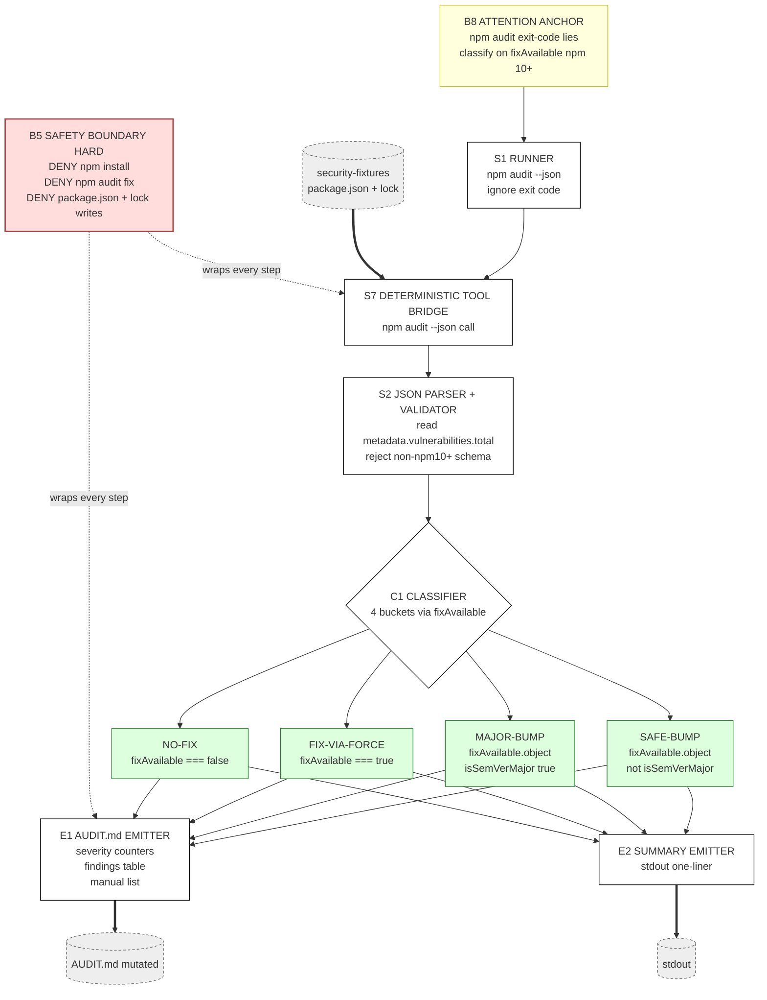

# Track 3 · `dependency-auditor`

> **You are not fixing the app. You are authoring a Skill** that runs `npm audit` against `zava-storefront/security-fixtures/`, parses the JSON, ranks issues by severity, and emits a remediation plan as a PR comment — with safe-bump vs. breaking-bump split.

⏱️ **90 min**

---

## 📚 Theory anchor

- **Live:** [Architectural Patterns Rosetta Stone — *Triage / classifier patterns*](https://danielmeppiel.github.io/agentic-sdlc-handbook/handbook/ch19-architectural-patterns-rosetta-stone.html)
- **Live:** [The PROSE Specification](https://danielmeppiel.github.io/agentic-sdlc-handbook/handbook/ch13-the-prose-specification.html)

**Local fallback (3 sentences):** A dependency auditor is a *classifier with a fixed schema*. *Orchestrated Composition* applies — your Skill calls a deterministic tool (`npm audit --json`), then the LLM does only what humans hate doing: reading 50 advisories and producing a triaged plan. *Safety Boundaries* matter twice: never modify `package.json` directly (recommend, don't apply); never invent CVE IDs.

> ⚠️ The audit runs against `zava-storefront/security-fixtures/`, a **standalone, intentionally-vulnerable npm package** that's not imported by the application. See its [README](https://github.com/DevExpGbb/zava-storefront/blob/workshop-v1/security-fixtures/README.md).

---

## 🔍 Discover the problem

Run the raw tool yourself first. Use `--prefix` so cwd doesn't matter (and so you can never accidentally install fixture deps into the real app):

```bash
npm install --prefix zava-storefront/security-fixtures --no-audit --no-fund
npm audit --prefix zava-storefront/security-fixtures || true
```

> 💡 **`npm audit` exits non-zero when vulnerabilities are present** (i.e., always on this fixture). Append `|| true` in shell, or read `metadata.vulnerabilities.total` from `--json` — never trust the exit code alone in your Skill or in CI. Chaining with `&&` will short-circuit the rest of your pipeline.

You'll see a wall of advisories — `lodash` prototype pollution, `axios` SSRF, `minimist`. Now ask your AI chat assistant:

> "Fix the npm audit issues."

Observe:

- It might suggest `npm audit fix --force` (potentially breaking).
- It rarely splits *safe bumps* from *major-version bumps*.
- It doesn't produce something you can paste into a change-management ticket.

A Skill closes that gap.

---

## 🧠 Design with Genesis (5 min)

```
/genesis I want a dependency-auditor skill. It must:
- Run `npm audit --json` in zava-storefront/security-fixtures/
- Parse the JSON and rank vulnerabilities by severity (critical > high > moderate > low)
- For each entry under the top-level `vulnerabilities` object, classify the recommendation:
    safe-bump      → fixAvailable is an object AND fixAvailable.isSemVerMajor === false
    breaking-bump  → fixAvailable is an object AND fixAvailable.isSemVerMajor === true
    fix-via-force  → fixAvailable === true (boolean): a fix exists but npm did not
                     return a target version because the bump is at the top level
                     and requires `npm audit fix --force`. Treat as breaking until
                     a human inspects.
    manual-review  → fixAvailable === false (or missing)
- Emit a markdown report: top 5 critical findings, recommended bumps, and a "manual review" list
- Refuse to modify package.json itself — the Skill's output is a recommendation, not a code change

Draw an ASCII art diagram of the proposed skill architecture and explain the reasons of the design.
```

> 💡 **Schema reference (npm 10+).** `npm audit --json` returns `{ auditReportVersion, vulnerabilities, metadata }`. Each entry under `vulnerabilities` exposes `severity`, `range` (vulnerable range), and `fixAvailable` — one of `false`, `true` (boolean: requires `--force`), or `{ name, version, isSemVerMajor }`. Classify on `fixAvailable`, not on legacy `patched_versions`. The boolean-`true` shape is rare on this fixture (today's npm registry returns objects for all three baked-in deps), but real audits across many packages will produce it — handle it.

### What Genesis returned for this brief

Rendered in Mermaid for GitHub readability — Genesis emits ASCII into your chat. Same components, same edges. Yours may differ in naming; what must hold is the **classifier as a first-class node** with all four buckets, and the **hard safety boundary** against package.json/lockfile mutations.



**Why this shape (rationale Genesis explained):**

- **A pipeline with a closed classifier — not a panel of agents.** There are no independent lenses to synthesize. One deterministic input, one deterministic schema, four mutually exclusive buckets. Adding agents would invent disagreement the data doesn't have.
- **One anchor pinned at the top: `npm audit` exit code lies.** The Skill must *expect* non-zero (findings are always present) and classify by JSON, not by exit code. The anchor lives above every step so context drift can't dilute it. (Genesis: *ATTENTION ANCHOR*.)
- **The classifier is a first-class node with all four buckets named.** SAFE-bump, breaking-bump, fix-via-force, manual-review — that closed set is the contract the rubric regression test validates. Inventing a fifth bucket inline means the rubric is wrong, not the data.
- **A hard safety boundary wraps every consequential step.** DENY-list: no `npm install`, no `npm audit fix`, no `--force`, no writes to `package.json`/lockfile/`node_modules`. Recommendation, not remediation. The boundary is rendered as a node, not buried in prose. (Genesis: PROSE *Safety Boundaries*, hard variant.)
- **A deterministic tool is the only authority on the data.** `npm audit --json` is the source of truth — the LLM never re-derives severity or `fixAvailable` from recall. (Genesis: *DETERMINISTIC TOOL BRIDGE*.)
- **Failure modes guarded:** classifying on `severity` instead of `fixAvailable` (anchor blocks); inferring a fifth bucket (classifier is closed); attempting `npm audit fix` because the LLM "thinks it's safe" (deny list rejects).

---

## 🛠️ Build (15 min) — *let Genesis implement what Genesis designed*

In the same chat where Genesis just emitted the design, prompt your harness:

> Now use the genesis skill to implement the skill per our agreed design. Place it at `.apm/skills/dependency-auditor/`.

That's it. Genesis takes over: it applies its own step-7b discipline (probe runtime, draft SKILL.md, validate against the design — including all four classifier branches and the read-only `allowed-tools` constraint). Any installed instructions — like `prose-style.md` from `code-kit` — get loaded by the harness automatically.

Review the output node-for-node against the design diagram — especially the classifier rubric (the rubric regression test in §Validate locks it down) and the absence of `Edit` from `allowed-tools` (the skill must not be able to mutate code).

### Iterate naturally

The high-leverage moves aren't tweaks to the *original* prompt — they're new asks that build on what Genesis just shipped. Each one shows Genesis applying its own discipline to a real evolutionary need:

- **Add real behavior evals** *(the agentskills.io kind, not a regression test)*. *"Use the genesis skill to add evals for this skill."* Genesis applies its step-6 EVALS PLAN: 2-3 content evals (each prompt run twice, **with_skill vs without_skill**, so the value delta is measurable) plus ~20 trigger evals (8-10 should-trigger + 8-10 near-miss, 60/40 train/val) for the dispatch description. Output: `evals/evals.json` + `evals/triggers.json`. Per the spec, **assertions are added after the first run** — iteration 1 explores, iteration 2 hardens. Ship gate: `with_skill` PASS AND measurable delta vs `without_skill`. If they're indistinguishable, the skill is not adding value.
- **Make it run in CI/CD.** *"Use the genesis skill to make this run in CI/CD."* Genesis proposes a [`gh-aw`](https://githubnext.com/projects/agentic-workflows/) agentic workflow — paths filter on `package.json`/`package-lock.json`, the same audit running on every dependency PR.
- **Modularize the specialist personas.** *"Use the genesis skill to modularize the specialist personas as a separate apm package."* Genesis proposes a package split — pulls the supply-chain risk persona into its own pinnable APM package shared with `secure-baseline`.

That's the loop you'll keep using long after the workshop: the skill grows by composition, not by hand-edits.

📁 Stuck? Peek at [`docs/golden-examples/dependency-auditor.SKILL.md`](../golden-examples/dependency-auditor.SKILL.md) — but only after Genesis has produced its first draft.

---

## ✅ Validate locally (5 min)

> "Use the dependency-auditor skill on `zava-storefront/security-fixtures/`."

Expect a report listing at minimum:

- 1 high or critical advisory each for `lodash`, `axios`, `minimist`
- Bump recommendations split safe / breaking
- No modifications to any `package.json`

### Demonstrate MANUAL-REVIEW classification

The three baked-in fixtures all have fixes (`safe-bump` / `breaking-bump`). To exercise the third branch — `manual-review` (`fixAvailable === false`) — feed the Skill a synthetic snippet:

```bash
cat <<'EOF' > /tmp/manual-review-fixture.json
{
  "auditReportVersion": 2,
  "vulnerabilities": {
    "abandoned-pkg": {
      "severity": "high",
      "range": "*",
      "fixAvailable": false
    }
  },
  "metadata": { "vulnerabilities": { "high": 1, "critical": 0, "moderate": 0, "low": 0 } }
}
EOF
```

Then in your harness:

> "Use the dependency-auditor skill on the npm-audit JSON at `/tmp/manual-review-fixture.json`."

Expected output: `abandoned-pkg` lands under **Manual review**, with rationale `fixAvailable === false — no automated remediation; investigate upstream`. If it lands under safe-bump or breaking-bump instead, your classifier rubric is mis-ordered — fix the SKILL.md and retry. This is exactly the kind of off-happy-path case the rubric regression test in §Validate locks down; **see it once by hand here so you trust the test afterwards**.

### Run the rubric regression test

Once your Skill produces a clean live report and a clean MANUAL-REVIEW report by hand, run the regression script — it asserts the exact classifications + fix versions the rubric should produce, including all four branches (`safe-bump`, `breaking-bump`, `fix-via-force`, `manual-review`):

```bash
apm run regression-track-3       # → ✅ dependency-auditor rubric regression PASSED
```

Pure Node, no deps, runs in <2s. Mirrors Track 4's `evals/run.js` pattern. **This is a regression test for the classifier rubric — not a behavior eval.** It catches "did someone change the rubric without updating the expected file?" It does NOT catch "is the LLM producing useful output?" — that's what the agentskills.io-style behavior evals (added via Genesis in the §Iterate-naturally step) test, by running each prompt twice (with_skill vs without_skill) and comparing.

Read [`docs/golden-examples/dependency-auditor.evals/README.md`](../golden-examples/dependency-auditor.evals/README.md) for both layers — Layer 1 is the behavior evals (`evals.json` + `triggers.json`), Layer 2 is this regression script. The maintenance contract: the rubric in your SKILL.md and the script's `classify()` function are a single source of truth split across two files; they move together.

---

## 📦 Package locally (5 min) — *see what `apm pack` actually ships*

Before you automate anything, run the pack command yourself and look at the artifact:

```bash
apm pack --archive
ls build/
# → build/dependency-auditor-0.1.0.tar.gz

tar tzf build/dependency-auditor-0.1.0.tar.gz
```

You'll see the bundle contains:

- `plugin.json` — synthesized from your `apm.yml` (run `apm init --plugin` to commit one explicitly)
- `apm.lock.yaml` — dependency pin manifest
- `skills/dependency-auditor/SKILL.md` — what consumers actually load
- `skills/dependency-auditor/references/`, `evals/` — anything else under your skill folder

That tarball is your skill bundle. Hand it to a teammate, they `apm install` it, and your skill is live in their harness. **No magic** — a manifest and a directory tree.

> 💡 **Why didn't Genesis or the kits end up in the tarball?** They're `devDependencies` in `apm.yml` — author-time tooling, not runtime requirements of your skill. `apm pack` excludes them, so consumers don't pull them transitively. The scanner also only looks under `.apm/` (which is why the Build prompt told Genesis to place your skill at `.apm/skills/dependency-auditor/`). See [dev-only primitives](https://microsoft.github.io/apm/guides/dev-only-primitives/) and [`includes:` schema](https://microsoft.github.io/apm/reference/manifest-schema/#39-includes).

## 🚀 Automate the release (5 min)

Now that you've seen the local flow, automate it. The [release workflow](../../.github/workflows/release.yml) runs the same `apm pack` on every tagged push:

```bash
git add . && git commit -m "feat: dependency-auditor skill v0.1.0"

# If you ran multiple tracks in the same repo, scope the tag:
git tag v0.1.0-dependency-auditor   # or just v0.1.0 if this is your only track
git push origin main --tags
```

> 💡 **Tag collision warning.** Every track guide says `git tag v0.1.0`. If you re-run or run multiple tracks in the same repo, scope per-track (`v0.1.0-dependency-auditor`) or delete the old tag first.

The [release workflow](../../.github/workflows/release.yml) validates → packs → publishes a GitHub Release with the tarball attached.

---

## 🌐 Automate (15 min) — run your skill in CI

The skill you just released is now a portable artifact. Time to make your own CI a consumer of it. The auditor posts its report as a PR comment. **It does not auto-merge or auto-bump.** That's the auditor's whole point.

The template ships a starter [gh-aw](https://github.github.com/gh-aw/) workflow at [`.github/workflows/my-workflow.md`](../../.github/workflows/my-workflow.md). gh-aw workflows are markdown: YAML frontmatter for triggers + permissions, then a natural-language prompt the agent runs. Replace the file's contents with this — note the `packages:` line pins the release tag you just pushed:

```markdown
---
on:
  pull_request:
    types: [labeled]
    paths: ['**/package.json']
  workflow_dispatch:
  roles: [admin, maintainer, write]

if: |
  (github.event_name == 'pull_request' && github.event.label.name == 'run-dependency-auditor')
  || github.event_name == 'workflow_dispatch'

permissions:
  contents: read
  pull-requests: read
  issues: read

network: defaults

engine:
  id: copilot

# Pin the skill you just released. apm-action will download this tarball
# at run-time and make `dependency-auditor` available to the agent below.
imports:
  - uses: shared/apm.md
    with:
      packages:
        - <your-org>/<your-repo>#v0.1.0-dependency-auditor

safe-outputs:
  add-comment:
    max: 1

timeout-minutes: 15
---

# Run dependency-auditor

You are running the **`dependency-auditor`** Agent Skill against this repository's
`zava-storefront/` directory. Follow its `SKILL.md` exactly. Run `npm audit`,
classify each finding (safe-bump / breaking-bump / fix-via-force / manual-review),
and post the structured report via `add-comment`.

Do not modify `package.json` or `package-lock.json`. Do not merge or label the PR.
Recommendations only.
```

Then create the trigger label, compile, and push:

> 💡 **Before you push — gh aw auth.** If `gh aw compile` succeeds but the workflow run fails at the Copilot step with `Resource not accessible by personal access token` or `401 no token`, the `COPILOT_GITHUB_TOKEN` org secret isn't set or isn't visible to this repo. Run `gh secret list --org <your-org>` to confirm. If missing, an org admin sets it — see [`zava-workshop-kit/docs/tokens.md`](https://github.com/DevExpGbb/zava-workshop-kit/blob/main/docs/tokens.md). You don't need your own PAT; the org secret with `--visibility=all` covers your repo. Spec: fine-grained PAT, resource owner = user account, single permission `Account → Copilot Requests: Read`, owner has an active Copilot seat. See [`gh aw` auth reference](https://github.github.com/gh-aw/reference/auth/#copilot_github_token).

```bash
gh label create run-dependency-auditor --color FFB0B0 --description "Run the dependency-auditor skill on this PR"
gh aw compile      # → .github/workflows/my-workflow.lock.yml
git add .github/workflows/ && git commit -m "ci: wire dependency-auditor in CI"
git push
```

Open a PR touching any `package.json`, label it `run-dependency-auditor`, and watch the workflow comment a structured audit report.

> 💡 **The release tag you just pushed is what your CI pins.** The `apm pack` → release tarball → `imports.with.packages` chain is the same mechanism another team would use to consume your skill — your CI just happens to be one of those consumers. Bump the tag, bump the pin: same flow as any versioned dependency.

> 💡 **What is `shared/apm.md`?** A vendored gh-aw [shared workflow component](https://microsoft.github.io/apm/integrations/gh-aw/) that turns `packages:` into a real `apm install` step in your compiled workflow. The template ships it pre-vendored at [`.github/workflows/shared/apm.md`](../../.github/workflows/shared/apm.md). If you ever start a workflow from scratch in another repo, copy it once: `mkdir -p .github/workflows/shared && curl -sSL https://raw.githubusercontent.com/microsoft/apm/main/.github/workflows/shared/apm.md > .github/workflows/shared/apm.md`. See [`gh aw` reference: workflow lock file](https://github.github.com/gh-aw/reference/faq/#what-is-a-workflow-lock-file) for why the `.md` and `.lock.yml` both ship.

> 💡 **Compose with kit primitives.** Add more lines under `packages:` — e.g., `DevExpGbb/zava-agent-config/plugins/secure-baseline#v5.0.1` to also load the security-baseline instructions alongside your auditor. Same import block, more primitives available to the agent.

---

## 🌍 Platform payoff (your Skill in someone else's repo)

After §2 of the README, a partner team can pin your auditor in *their* repo:

```yaml
# their apm.yml
dependencies:
  apm:
    - <your-org>/<your-repo>#v0.1.0-dependency-auditor
```

`apm install` and they have the same `SKILL.md`, the same read-only `allowed-tools`, the same report schema. Their CI now produces audit reports identical in structure to yours — that's how a skill becomes shared platform capability rather than a single-repo script.

---

## 🎓 What you learned

- **Classifier Skills compose with deterministic tools.** The LLM does the triage, not the scanning.
- **`allowed-tools` is the strongest safety lever.** No `Edit` → can't modify `package.json` → can't ship a breaking bump by accident.
- **Output schemas matter.** A predictable report is the difference between "useful" and "another bot comment."
