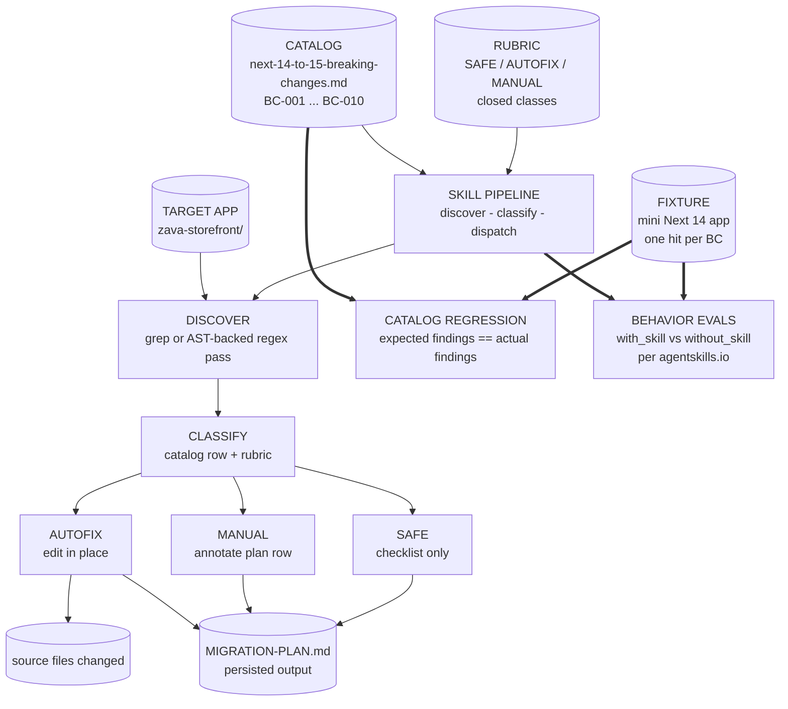

# Track 4 · `framework-modernizer` — ship a real Next 14 → 15 migration

> **You are not fixing the app by hand. You are authoring one Skill** that scans `zava-storefront/`, classifies real Next.js 14 → 15 upgrade findings, applies the safe mechanical edits, and leaves a `MIGRATION-PLAN.md` for the work that needs human judgment.

⏱️ **~90 min**

---

## 📚 Theory anchor

- **Live:** [Architectural Patterns Rosetta Stone — *Pipeline / Catalog patterns*](https://danielmeppiel.github.io/agentic-sdlc-handbook/handbook/ch19-architectural-patterns-rosetta-stone.html)
- **Live:** [The Reference Architecture](https://danielmeppiel.github.io/agentic-sdlc-handbook/handbook/ch04-the-reference-architecture.html)

**Local fallback (3 sentences):** A framework modernizer should not ask the model to remember breaking changes. It should load a cited catalog, run deterministic discovery, classify each hit into `SAFE`, `AUTOFIX`, or `MANUAL`, then persist the plan and edits. This is a PIPELINE because the work is single-pass discovery → classification → dispatch, not a debate between independent agents.

---

## 🔍 What you are building

The repo already contains a worked Express 4 → 5 reference skill at [`.apm/skills/framework-modernizer/`](../../.apm/skills/framework-modernizer/). You will use it as a shape reference, then build a **new `nextjs-modernizer` skill** for the real app in `zava-storefront/`.

The in-room deliverable is not a single catalog row. It is:

1. a real Next 14 → 15 catalog with about 6–10 cited `BC-NNN` entries,
2. a skill that scans the actual storefront,
3. `AUTOFIX` edits applied in place,
4. `MANUAL` items left with code pointers and rationale, and
5. a `MIGRATION-PLAN.md` that the team can review.

Do not hard-code expected storefront paths. The app may have dynamic product pages, category pages, route handlers, server components with `fetch`, or config files — let the skill discover what is really present.

---

## 🧪 1 · Warm up on the Express reference (10 min)

Open these files:

- [`.apm/skills/framework-modernizer/references/DESIGN.md`](../../.apm/skills/framework-modernizer/references/DESIGN.md)
- [`.apm/skills/framework-modernizer/references/express-4-to-5-breaking-changes.md`](../../.apm/skills/framework-modernizer/references/express-4-to-5-breaking-changes.md)
- [`.apm/skills/framework-modernizer/references/classifier-rubric.md`](../../.apm/skills/framework-modernizer/references/classifier-rubric.md)

Skim them. Notice the rule that matters: **every breaking-change row cites a source anchor**. No invented breaking changes.

Now run the deterministic catalog regression:

```bash
node .apm/skills/framework-modernizer/evals/run.js
```

You should see:

```text
✅ framework-modernizer catalog regression PASSED (8 findings match expected)
```

That test is fast because it has no LLM call. It proves the catalog regexes still find the fixture lines they are supposed to find.

---

## 🧠 2 · Design with Genesis (10 min)

Invoke Genesis before writing the skill:

```text
/genesis Design a nextjs-modernizer skill for a real Next.js 14 to 15 migration.
Use this official upgrade guide as the source of truth:
https://nextjs.org/docs/app/guides/upgrading/version-15

The skill must keep the same single-skill PIPELINE shape as the Express reference:
discover real hits in zava-storefront/ → classify against a closed SAFE/AUTOFIX/MANUAL rubric → dispatch AUTOFIX edits or MANUAL plan rows.
It must write MIGRATION-PLAN.md and must be testable with a deterministic catalog regression plus behavior evals.
Draw an ASCII architecture diagram and explain why this is a pipeline, not a panel.
```

Read the output before coding. Save the final design to `.apm/skills/nextjs-modernizer/references/DESIGN.md` when you create the skill folder.

---

## ✍️ 3 · Build the Next 14 → 15 catalog (25 min)

Create a catalog at:

```text
.apm/skills/nextjs-modernizer/references/next-14-to-15-breaking-changes.md
```

Use the official guide as your source: <https://nextjs.org/docs/app/guides/upgrading/version-15>. Build about 6–10 entries. Each entry must include:

```markdown
### BC-NNN — <short title>

- **Classification:** SAFE | AUTOFIX | MANUAL
- **Source:** <official guide URL with anchor>
- **Detect:** `<javascript regex>`
- **Example match:** `<one-line fixture snippet>`
- **Fix (if AUTOFIX):** `<replacement snippet or exact edit rule>`
- **Notes:** <one-line rationale>
```

Start from these real Next 15 changes. Adjust the regexes after scanning `zava-storefront/`; the examples below are starting points, not final truth.

| ID | Breaking change | Class | Source anchor | Detect idea | Fix rule |
|---|---|---|---|---|---|
| `BC-001` | `params` in App Router `page`, `layout`, metadata, route handlers, and metadata files are now async. Synchronous destructuring breaks. | `AUTOFIX` for simple async components; `MANUAL` for client components or complex props | `https://nextjs.org/docs/app/guides/upgrading/version-15#async-request-apis-breaking-change` | `function\s+(Page|Layout|generateMetadata)|export\s+default\s+(async\s+)?function` plus `params` | Change props to an async value and `await params` before destructuring. |
| `BC-002` | `searchParams` in App Router pages are now async. | `AUTOFIX` for simple async pages; `MANUAL` for client components using `use()` | `https://nextjs.org/docs/app/guides/upgrading/version-15#params--searchparams` | `searchParams\s*[:}]` and later property access/destructure | Await `props.searchParams` before reading query fields. |
| `BC-003` | `cookies()`, `headers()`, and `draftMode()` are now async request APIs. | `AUTOFIX` when the containing function can be async; otherwise `MANUAL` | `https://nextjs.org/docs/app/guides/upgrading/version-15#async-request-apis-breaking-change` | `\b(cookies|headers|draftMode)\(\)` | Insert `await` and make the containing server function async. |
| `BC-004` | `fetch` is no longer cached by default in Server Components. | `MANUAL` | `https://nextjs.org/docs/app/guides/upgrading/version-15#fetch-requests` | `await\s+fetch\([^,\n\)]*\)` | Decide per call: add `{ cache: 'force-cache' }`, `next: { revalidate }`, or leave uncached. |
| `BC-005` | `GET` Route Handlers are no longer cached by default. | `MANUAL` | `https://nextjs.org/docs/app/guides/upgrading/version-15#route-handlers` | `export\s+async\s+function\s+GET\s*\(` | Decide whether to add `export const dynamic = 'force-static'`. |
| `BC-006` | `experimental-edge` runtime is now invalid; use `edge`. | `AUTOFIX` | `https://nextjs.org/docs/app/guides/upgrading/version-15#runtime-configuration-breaking-change` | `runtime\s*=\s*['"]experimental-edge['"]` | Replace with `runtime = 'edge'`. |
| `BC-007` | `@next/font/*` was removed; use built-in `next/font/*`. | `AUTOFIX` | `https://nextjs.org/docs/app/guides/upgrading/version-15#nextfont` | `from\s+['"]@next/font/` | Replace `@next/font/` with `next/font/`. |
| `BC-008` | React and React DOM must move to 19; Server Actions should be reviewed for stricter serialization at the boundary. | `MANUAL` | `https://nextjs.org/docs/app/guides/upgrading/version-15#react-19` | `"react"\s*:\s*"\^?18|"react-dom"\s*:\s*"\^?18|useFormState|server action` | Update dependencies and review Server Actions so values like `Date`, `Map`, and class instances are converted to plain serializable data. |
| `BC-009` | `experimental.bundlePagesExternals` is now `bundlePagesRouterDependencies`. | `AUTOFIX` | `https://nextjs.org/docs/app/guides/upgrading/version-15#bundlepagesrouterdependencies` | `bundlePagesExternals` | Move to top-level `bundlePagesRouterDependencies`. |
| `BC-010` | `experimental.serverComponentsExternalPackages` is now `serverExternalPackages`. | `AUTOFIX` | `https://nextjs.org/docs/app/guides/upgrading/version-15#serverexternalpackages` | `serverComponentsExternalPackages` | Move to top-level `serverExternalPackages`. |

Pick the rows that fit the storefront. If a row does not apply, keep it in the catalog only if the official guide makes it relevant to this app family and your fixture covers it.

---

## 🔁 Reference shape — closed loop

Keep this shape. Rename nodes for Next.js, but do not turn it into a panel.



**Why this shape:**

- **Pipeline, not panel.** Each finding flows through the same stages. There are no independent expert opinions to reconcile.
- **Every finding cites a catalog row.** No row means no finding.
- **Grep or an AST helper does the matching, not the LLM.** The model can explain and edit, but discovery starts from deterministic matches.
- **The plan is a file.** `MIGRATION-PLAN.md` outlives the chat and can be reviewed in a PR.
- **The rubric is closed.** Use only `SAFE`, `AUTOFIX`, and `MANUAL`.
- **Two test layers.** Catalog regression catches broken regexes; behavior evals prove the skill beats `without_skill`.

---

## 🛠️ 4 · Build the skill and run it on the real app (25 min)

Create:

```text
.apm/skills/nextjs-modernizer/SKILL.md
.apm/skills/nextjs-modernizer/references/DESIGN.md
.apm/skills/nextjs-modernizer/references/next-14-to-15-breaking-changes.md
.apm/skills/nextjs-modernizer/references/classifier-rubric.md
.apm/skills/nextjs-modernizer/evals/
```

Prompt your harness:

```text
Use the nextjs-modernizer skill on zava-storefront/.
Scan the real tree. Classify each finding using the catalog and rubric.
Apply AUTOFIX edits in place. Do not apply MANUAL edits.
Write zava-storefront/MIGRATION-PLAN.md with:
1. Autofixed items already done,
2. Manual items with file/line pointers and judgment rationale,
3. Validation checklist.
```

Then inspect the output:

```bash
git --no-pager diff -- zava-storefront
git --no-pager diff -- zava-storefront/MIGRATION-PLAN.md
```

Eyeball at least one applied autofix. Good examples are:

- a dynamic route page or layout that now awaits `params`,
- a page that now awaits `searchParams`,
- `experimental-edge` changed to `edge`,
- `@next/font/*` changed to `next/font/*`, or
- a renamed `next.config.js` option.

Read the manual section of `MIGRATION-PLAN.md`. `fetch` caching and route-handler caching should usually stay manual because the right answer depends on product semantics, freshness, and origin load.

---

## ✅ 5 · Lock it with regression (10 min)

Copy the Express pattern instead of inventing a new harness:

```text
.apm/skills/framework-modernizer/evals/run.js
.apm/skills/framework-modernizer/evals/expected/findings.txt
.apm/skills/framework-modernizer/evals/fixtures/express4-app/
```

Create a small Next fixture under:

```text
.apm/skills/nextjs-modernizer/evals/fixtures/next14-app/
```

Add one representative line per catalog entry, and a decoy line for at least two entries. Then create:

```text
.apm/skills/nextjs-modernizer/evals/expected/findings.txt
```

Use exact expected rows, not `>= 1` assertions. The runner should fail when a regex matches too little or too much.

Run until green:

```bash
node .apm/skills/nextjs-modernizer/evals/run.js
```

Name the success output clearly, for example:

```text
✅ nextjs-modernizer catalog regression PASSED (N findings match expected)
```

For take-home, ask Genesis to scaffold behavior evals in the same style as the reference:

```text
Use the genesis skill to scaffold behavior evals for nextjs-modernizer per agentskills.io.
Include with_skill and without_skill cases plus dispatch trigger evals.
```

---

## 📋 6 · Review the handoff (10 min)

Before you stop, read `zava-storefront/MIGRATION-PLAN.md` like a reviewer. Confirm the autofixed section matches the diff, the manual section gives enough file/line context for a human, and the validation checklist includes install, build, test, and one product smoke check. If the plan is vague, fix the skill instructions now; vague migration plans do not get clearer in CI.

---

## 🧭 When this is not enough

A single-axis catalog-driven bump, like this Next 14 → 15 exercise, is exactly where a PIPELINE is the right answer. If the migration has interacting axes — for example the framework bump also forces a breaking `pg` 8 → 9 upgrade and a runtime or bundler default flip where ordering matters, compatibility windows matter, and rollback is not atomic — use the multi-agent review-panel pattern instead; see [Agentic SDLC track](agentic-sdlc.md) and [`docs/golden-examples/review-panel/`](../golden-examples/review-panel/).

---

## 📦 Take-home

Finish the fork properly:

1. Expand the catalog to all relevant Next 15 guide entries for your app family.
2. Keep every row cited to an official source anchor.
3. Keep the fixture small, but cover each catalog row with one expected hit.
4. Keep `expected/findings.txt` exact.
5. Run the catalog regression in CI.
6. Add behavior evals with `with_skill` and `without_skill` runs.
7. Run the skill on a fresh branch, review `MIGRATION-PLAN.md`, and open a PR with the autofix diff.

> 📚 **Going deeper.** Re-read the reference `DESIGN.md` section on forking this pattern after the workshop; it explains which parts should stay stable and which parts should change per framework.

---

## 🎓 What you learned

- **A modernizer is only as good as its catalog.** Source anchors keep the skill from inventing upgrade work.
- **The real deliverable is a partial migration.** Safe edits are applied; judgment calls are visible in `MIGRATION-PLAN.md`.
- **The rubric protects the app.** `AUTOFIX` is for mechanical edits; caching, Server Actions, and data freshness usually stay `MANUAL`.
- **Regression tests protect the catalog.** Exact expected findings catch regex drift before CI runs the skill on a real app.
- **Behavior evals prove value.** `with_skill` must beat `without_skill`, or the skill is not pulling its weight.
